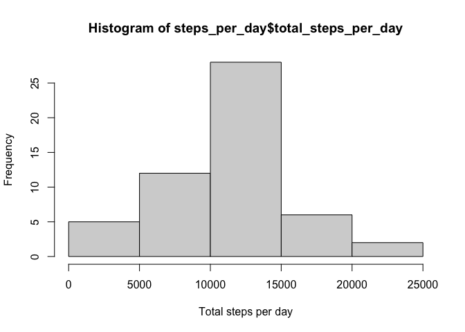
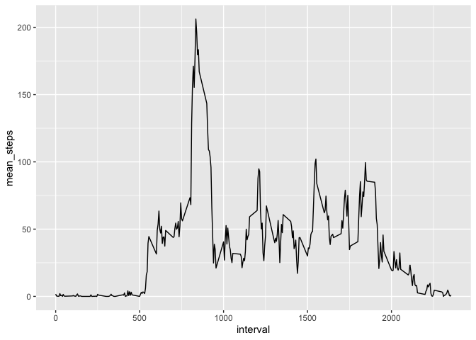
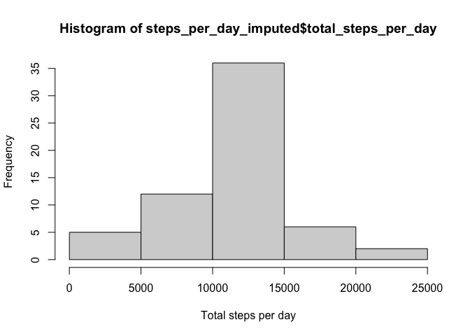
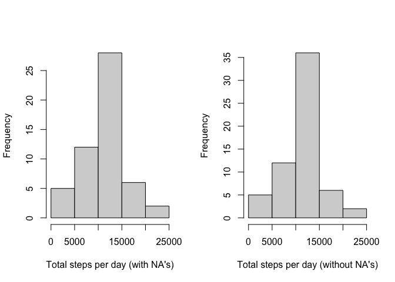
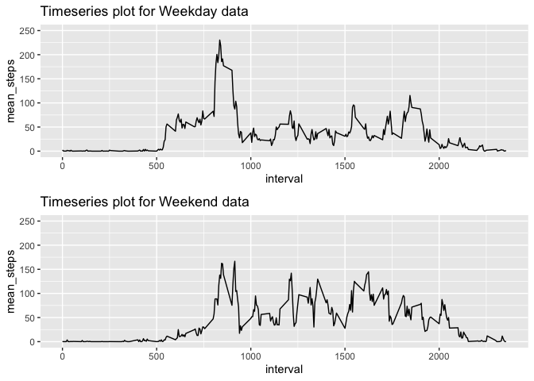

## Loading and preprocessing the data
The first step to unzip the data.

``` r
unzip("activity.zip")
```

We then load the data, convert it to a dataframe, and extract the summary.

``` r
activity = read.csv("activity.csv")
activity = as.data.frame.matrix(activity)
summary(activity)
```

```
##      steps            date              interval     
##  Min.   :  0.00   Length:17568       Min.   :   0.0  
##  1st Qu.:  0.00   Class :character   1st Qu.: 588.8  
##  Median :  0.00   Mode  :character   Median :1177.5  
##  Mean   : 37.38                      Mean   :1177.5  
##  3rd Qu.: 12.00                      3rd Qu.:1766.2  
##  Max.   :806.00                      Max.   :2355.0  
##  NA's   :2304
```

We can see that there are null values, and also that the date column is a character type and not a date type, so we convert it to Date format so it is ready for future use.


``` r
activity$date = as.Date(activity$date, format =  "%Y-%m-%d")
head(activity)
```

```
##   steps       date interval
## 1    NA 2012-10-01        0
## 2    NA 2012-10-01        5
## 3    NA 2012-10-01       10
## 4    NA 2012-10-01       15
## 5    NA 2012-10-01       20
## 6    NA 2012-10-01       25
```

## What is mean total number of steps taken per day?
Since it is stated that NA's can be ignored, we can remove the rows with NA values in the steps column

``` r
library(tidyr)
data = activity %>% drop_na(steps)
head(data)
```

```
##     steps       date interval
## 289     0 2012-10-02        0
## 290     0 2012-10-02        5
## 291     0 2012-10-02       10
## 292     0 2012-10-02       15
## 293     0 2012-10-02       20
## 294     0 2012-10-02       25
```

We then calculate the total number of steps taken per day by first grouping by the date column and extracting the sum of the steps column.

``` r
library(dplyr)
```

```
## 
## Attaching package: 'dplyr'
```

```
## The following objects are masked from 'package:stats':
## 
##     filter, lag
```

```
## The following objects are masked from 'package:base':
## 
##     intersect, setdiff, setequal, union
```

``` r
steps_per_day = data %>%
  group_by(date = date) %>%
  summarise(
    total_steps_per_day = sum(as.numeric(steps))
  )
head(steps_per_day)
```

```
## # A tibble: 6 × 2
##   date       total_steps_per_day
##   <date>                   <dbl>
## 1 2012-10-02                 126
## 2 2012-10-03               11352
## 3 2012-10-04               12116
## 4 2012-10-05               13294
## 5 2012-10-06               15420
## 6 2012-10-07               11015
```

We can also create a histogram of the total number of steps taken each day.

``` r
hist(steps_per_day$total_steps_per_day, xlab = "Total steps per day", border = "black")
```

<!-- -->

With the summarise() function, we can calculate and report the mean and median of the total number of steps taken per day, which is 10766 and 10765, respectfully.


``` r
mean_median <- steps_per_day %>% summarise(mean=mean(steps_per_day$total_steps_per_day), 
                                 median=median(steps_per_day$total_steps_per_day))
mean_median
```

```
## # A tibble: 1 × 2
##     mean median
##    <dbl>  <dbl>
## 1 10766.  10765
```


## What is the average daily activity pattern?

First we need to group the data by the interval column and calculate the average number of steps taken across all days.


``` r
interval_data = data %>% group_by(interval) %>% 
  summarise(mean_steps=mean(steps),
            .groups = 'drop')
head(interval_data)
```

```
## # A tibble: 6 × 2
##   interval mean_steps
##      <int>      <dbl>
## 1        0     1.72  
## 2        5     0.340 
## 3       10     0.132 
## 4       15     0.151 
## 5       20     0.0755
## 6       25     2.09
```

Next, we can create a time series plot of the 5-minute interval (x-axis) and the average number of steps taken, averaged across all days (y-axis)


``` r
library(ggplot2)

#create time series plot
p <- ggplot(interval_data, aes(x=interval, y=mean_steps)) +
       geom_line()
p
```

<!-- -->


We can see that the 5-minute interval that contains the maximum number of steps is 835, with value 206.1698.

``` r
index_of_maximum_value = which.max(interval_data$mean_steps)
maximum_value = interval_data[index_of_maximum_value,]
maximum_value
```

```
## # A tibble: 1 × 2
##   interval mean_steps
##      <int>      <dbl>
## 1      835       206.
```

## Imputing missing values
First, let's look at the total count of null values for each column.

``` r
f <- sapply(activity, summary)
f
```

```
## $steps
##    Min. 1st Qu.  Median    Mean 3rd Qu.    Max.    NA's 
##    0.00    0.00    0.00   37.38   12.00  806.00    2304 
## 
## $date
##         Min.      1st Qu.       Median         Mean      3rd Qu.         Max. 
## "2012-10-01" "2012-10-16" "2012-10-31" "2012-10-31" "2012-11-15" "2012-11-30" 
## 
## $interval
##    Min. 1st Qu.  Median    Mean 3rd Qu.    Max. 
##     0.0   588.8  1177.5  1177.5  1766.2  2355.0
```

It seems that only the steps column contains 2304 null values.

We can replace the null values with the mean number of steps for that interval and create a new imputed dataset.


``` r
library(dplyr)
library(tidyr)

new_dataset = activity

new_dataset = new_dataset %>% 
  group_by(interval) %>% 
  mutate_if(is.numeric, 
            function(x) ifelse(is.na(x), 
                               mean(x, na.rm = TRUE), 
                               x))
```

```
## `mutate_if()` ignored the following grouping variables:
## • Column `interval`
```

``` r
head(new_dataset)
```

```
## # A tibble: 6 × 3
## # Groups:   interval [6]
##    steps date       interval
##    <dbl> <date>        <int>
## 1 1.72   2012-10-01        0
## 2 0.340  2012-10-01        5
## 3 0.132  2012-10-01       10
## 4 0.151  2012-10-01       15
## 5 0.0755 2012-10-01       20
## 6 2.09   2012-10-01       25
```


Next, we group by date and get the total number of steps for each day.

``` r
steps_per_day_imputed = new_dataset %>%
  group_by(date = date) %>%
  summarise(
    total_steps_per_day = sum(as.numeric(steps))
  )
head(steps_per_day_imputed)
```

```
## # A tibble: 6 × 2
##   date       total_steps_per_day
##   <date>                   <dbl>
## 1 2012-10-01              10766.
## 2 2012-10-02                126 
## 3 2012-10-03              11352 
## 4 2012-10-04              12116 
## 5 2012-10-05              13294 
## 6 2012-10-06              15420
```

We then create a histogram.


``` r
hist(steps_per_day_imputed$total_steps_per_day, xlab = "Total steps per day", border = "black")
```

<!-- -->

The summarise() function can calculate and report the mean and median of the total number of steps taken per day, with mean and median being 10766.19 and 10766.19 respectfully.


``` r
mean_median_imputed <- steps_per_day_imputed %>% summarise(mean=mean(steps_per_day_imputed$total_steps_per_day), 
                                 median=median(steps_per_day_imputed$total_steps_per_day))
mean_median_imputed
```

```
## # A tibble: 1 × 2
##     mean median
##    <dbl>  <dbl>
## 1 10766. 10766.
```

Let's compare thos values with the previous mean and median. We can see that the mean stays the same, but the median is now 10766.19, instead of 10765.00.


``` r
rbind(mean_median, mean_median_imputed)
```

```
## # A tibble: 2 × 2
##     mean median
##    <dbl>  <dbl>
## 1 10766. 10765 
## 2 10766. 10766.
```

Let's compare the histograms as well.

``` r
par(mfrow = c(1, 2))

hist(steps_per_day$total_steps_per_day, xlab = "Total steps per day (with NA's)", border = "black", main=NULL)
hist(steps_per_day_imputed$total_steps_per_day, xlab = "Total steps per day (without NA's)", border = "black", main=NULL)
```

<!-- -->

Regarding the impact of imputing missing data on the estimates of the total daily number of steps, we can see that the frequency increases due to more values present.


## Are there differences in activity patterns between weekdays and weekends?


First, let's extract the week day using the weekdays() function, and create two new columns, the weekday which will contain the exact day of the week, and the weekday_weekend, which will state whether it's a weekday or weekend.


``` r
weekend_data <- new_dataset
weekend_data$weekday <- weekdays(weekend_data$date)
weekend_data$weekday_weekend <- with(weekend_data, ifelse(weekday %in% c("Saturday", "Sunday"), 'weekend', 'weekday'))

weekend_data
```

```
## # A tibble: 17,568 × 5
## # Groups:   interval [288]
##     steps date       interval weekday weekday_weekend
##     <dbl> <date>        <int> <chr>   <chr>          
##  1 1.72   2012-10-01        0 Monday  weekday        
##  2 0.340  2012-10-01        5 Monday  weekday        
##  3 0.132  2012-10-01       10 Monday  weekday        
##  4 0.151  2012-10-01       15 Monday  weekday        
##  5 0.0755 2012-10-01       20 Monday  weekday        
##  6 2.09   2012-10-01       25 Monday  weekday        
##  7 0.528  2012-10-01       30 Monday  weekday        
##  8 0.868  2012-10-01       35 Monday  weekday        
##  9 0      2012-10-01       40 Monday  weekday        
## 10 1.47   2012-10-01       45 Monday  weekday        
## # … with 17,558 more rows
```

Then, we separate the weekday and weekend data so we can create a panel plot containing a time series plot of the 5-minute interval (x-axis) and the average number of steps taken, averaged across all weekday days or weekend days (y-axis).


``` r
weekday = weekend_data[weekend_data$weekday_weekend=='weekday', ]
head(weekday)
```

```
## # A tibble: 6 × 5
## # Groups:   interval [6]
##    steps date       interval weekday weekday_weekend
##    <dbl> <date>        <int> <chr>   <chr>          
## 1 1.72   2012-10-01        0 Monday  weekday        
## 2 0.340  2012-10-01        5 Monday  weekday        
## 3 0.132  2012-10-01       10 Monday  weekday        
## 4 0.151  2012-10-01       15 Monday  weekday        
## 5 0.0755 2012-10-01       20 Monday  weekday        
## 6 2.09   2012-10-01       25 Monday  weekday
```


``` r
weekend = weekend_data[weekend_data$weekday_weekend=='weekend', ]
head(weekend)
```

```
## # A tibble: 6 × 5
## # Groups:   interval [6]
##   steps date       interval weekday  weekday_weekend
##   <dbl> <date>        <int> <chr>    <chr>          
## 1     0 2012-10-06        0 Saturday weekend        
## 2     0 2012-10-06        5 Saturday weekend        
## 3     0 2012-10-06       10 Saturday weekend        
## 4     0 2012-10-06       15 Saturday weekend        
## 5     0 2012-10-06       20 Saturday weekend        
## 6     0 2012-10-06       25 Saturday weekend
```

Next, we calculate the mean number of steps by first grouping by the interval column.


``` r
weekday_mean = weekday %>% group_by(interval) %>% 
  summarise(mean_steps=mean(steps),
            .groups = 'drop')
head(weekday_mean)
```

```
## # A tibble: 6 × 2
##   interval mean_steps
##      <int>      <dbl>
## 1        0     2.25  
## 2        5     0.445 
## 3       10     0.173 
## 4       15     0.198 
## 5       20     0.0990
## 6       25     1.59
```


``` r
weekend_mean = weekend %>% group_by(interval) %>% 
  summarise(mean_steps=mean(steps),
            .groups = 'drop')
head(weekend_mean)
```

```
## # A tibble: 6 × 2
##   interval mean_steps
##      <int>      <dbl>
## 1        0    0.215  
## 2        5    0.0425 
## 3       10    0.0165 
## 4       15    0.0189 
## 5       20    0.00943
## 6       25    3.51
```

Finally, we can create the plots.


``` r
require(gridExtra)
```

```
## Loading required package: gridExtra
```

```
## 
## Attaching package: 'gridExtra'
```

```
## The following object is masked from 'package:dplyr':
## 
##     combine
```

``` r
plot1 = ggplot(weekday_mean, aes(x=interval, y=mean_steps)) +
       geom_line() +
       ggtitle("Timeseries plot for Weekday data") +
       ylim(0, 250)
plot2 = ggplot(weekend_mean, aes(x=interval, y=mean_steps)) +
       geom_line() +
       ggtitle("Timeseries plot for Weekend data") +
       ylim(0, 250)

grid.arrange(plot1, plot2, ncol=1)
```

<!-- -->


